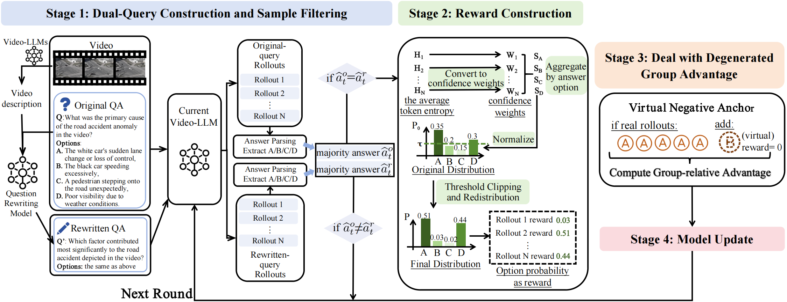

# Test-time Reinforcement Learning for Anomalous Video Understanding

Official implementation of **Test-time Reinforcement Learning for Anomalous
Video Understanding**.

Huining Li, Yuxiang Du, Jiyang Tan, Qian Li, MingCai Chen, Jian Zhang,
Xingdong Sheng, and Yuntao Du

> Paper and arXiv links will be added after the public release.

## Overview

Anomalous video understanding requires a model not only to detect unusual
events, but also to interpret the objects, actions, interactions, and event
semantics involved. Although Video-LLMs provide promising zero-shot
capabilities, a frozen model can struggle with diverse anomaly patterns and
changing deployment environments.

This work studies **online test-time reinforcement learning (TTRL)** for
anomalous video understanding. The model adapts directly to an incoming stream
of unlabeled test videos, without ground-truth answers or additional human
annotations, and carries the updated parameters forward to later samples.


## Method

<p align="center">
  
</p>

The framework contains four stages:

1. **Dual-query consistency filtering.** The original question is rewritten
   into a semantically equivalent query while preserving the answer choices.
   A sample is retained only when both query views produce the same strict
   majority answer.
2. **Entropy-aware consensus reward.** Answer agreement is combined with token
   entropy so that confident, consensus-aligned rollouts provide stronger and
   more informative optimization signals.
3. **Virtual negative anchor.** A virtual zero-reward anchor is introduced
   during advantage normalization for unanimous rollout groups, preventing
   group-relative advantages from vanishing. It has no completion and does not
   contribute directly to the token-level policy loss.
4. **Online GRPO update.** The model is updated on retained unlabeled samples,
   performs inference, and carries its adapted parameters into the next test
   round.


## Repository Structure

```text
TTRL-AVU/
├── annotations/             # VAU-Bench multiple-choice QA annotations
├── assets/                  # Images used by this README
├── configs/                 # Distributed and DeepSpeed configurations
├── scripts/
│   ├── training/            # Test-time GRPO launch scripts
│   └── evaluation/          # Classification evaluation launcher
├── src/
│   ├── evaluation/          # QA and classification evaluators
│   └── open_r1/             # Training, reward, and model utilities
├── environment.yml
└── README.md
```

## Environment Setup

The environment has been tested on Linux with Python 3.10, PyTorch 2.6.0,
and CUDA-enabled GPUs. A complete Conda specification is provided in
`environment.yml`.

```bash
conda env create -f environment.yml
conda activate ttrl-avu
```

Creating the environment downloads PyTorch and CUDA-related packages and may
take some time. Make sure that the installed NVIDIA driver is compatible with
the CUDA runtime used by PyTorch. Verify the installation with:

```bash
python -c "import torch; print(torch.__version__); print(torch.cuda.is_available())"
```

The default configuration uses Qwen2.5-VL-3B-Instruct from Hugging Face. If
the checkpoint is gated or downloaded from a private mirror, authenticate with
Hugging Face before training.

## Dataset Preparation

Download the original videos from the official dataset pages:

- [UCF-Crime](https://xuange923.github.io/Surveillance-Video-Understanding)
- [ECVA](https://github.com/Dulpy/ECVA)
- [MSAD](https://github.com/Tom-roujiang/MSAD)

The QA annotations used by this repository are provided in `annotations/`.
After downloading a dataset, place its videos in a directory of your choice.
Video filenames must match the `Video Name` column in the corresponding CSV
annotation file.

Example layout:

```text
TTRL-AVU/
├── annotations/
│   ├── test_ucf_crime_rewritten.csv
│   ├── test_ecva_rewritten.csv
│   └── test_msad_rewritten.csv
└── data/
    ├── ucf_crime/
    ├── ecva/
    └── msad/
```

The video directories do not need to be inside the repository. Set
`--train_video_folder` to the actual location in the training configuration.
Please follow the licenses and terms of use of the original datasets. This
repository does not redistribute the source videos.

## Training

Before running training, edit `scripts/training/run_grpo_video_qa.sh`. At
minimum, review and update:

- `CUDA_VISIBLE_DEVICES` and `--nproc_per_node`
- `--model_name_or_path`
- `--train_data_path` and `--train_video_folder`
- `--dataset_name`
- `--use_think_prompt`
- `--num_generations` and `--generation_batch_size`
- batch size, gradient accumulation, completion length, and DeepSpeed settings
- `--master_port`

From the repository root, run:

```bash
sh scripts/training/run_grpo_video_qa.sh
```

The script writes checkpoints to `checkpoints/`, TensorBoard logs to `logs/`,
and QA predictions to `results/qa/`. Inspect training metrics with:

```bash
tensorboard --logdir logs
```

## Evaluation

Training produces a post-adaptation prediction file similar to:

```text
results/qa/result_entropy_consensus_anchor_rewrite_<dataset>_<prompt-mode>.jsonl
```

Set `input_file` in `src/evaluation/evaluation_qa.py` to the JSONL file to
evaluate, then run:

```bash
cd src/evaluation
python evaluation_qa.py
```

The evaluator extracts an A/B/C/D answer, adds an `evaluation` field to each
record, and writes aggregate accuracy to a neighboring `*_evaluation.txt`
file. It updates the input JSONL file in place, so keep a copy when the
original predictions must remain unchanged.

## Citation

If this repository is useful in your research, please cite:

```bibtex
@article{li2026testtime,
  title   = {Test-time Reinforcement Learning for Anomalous Video Understanding},
  author  = {Li, Huining and Duan, Yuxiang and Tan, Jiyang and Li, Qian and
             Chen, MingCai and Zhang, Jian and Sheng, Xingdong and Du, Yuntao},
  journal = {arXiv preprint},
  year    = {2026}
}
```

The arXiv identifier and URL will be added after publication. Please also cite
UCF-Crime, ECVA, and MSAD when using the corresponding datasets.

## Acknowledgements

This codebase was developed by modifying
[VAU-R1](https://github.com/GVCLab/VAU-R1). We sincerely thank its authors for
releasing their code and annotations. We also thank the creators and
maintainers of UCF-Crime, ECVA, MSAD, Qwen2.5-VL, Hugging Face Transformers,
TRL, and DeepSpeed.
